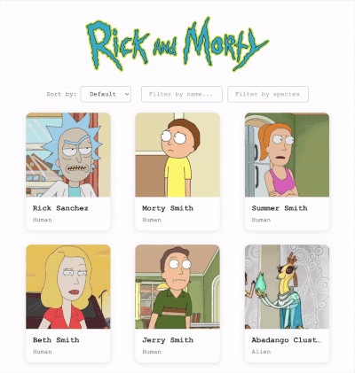

# Rick and Morty Challenge for Appspace

A React application that displays characters from the Rick and Morty universe using the [Rick and Morty GraphQL API](https://rickandmortyapi.com/graphql).

<p align="center">
  
</p>

## Getting Started

### Prerequisites

- Node.js (v18 or higher)
- npm

### Installation

```bash
npm install
```

### Development

```bash
npm run dev
```

The app will be available at `http://localhost:5173`.

### Running Tests

```bash
npm test           # Watch mode
npm test -- --run  # Single run
```

## Tech Stack

- **React 19 with TypeScript**: This is an obvious choice for this challenge.
- **Vite** - Build tool: Current best build tool for React Projects
- **TanStack Query** - Data fetching: Also current standard, it comes with automatic cache, I could have used Apollo but wanted to try TanStack Query with GraphQL as I only used it with REST.
- **GraphQL** - API: It is what I have been using for the last 5 years and also what you use at Appspace so I think it made sense to showcase that I can work with it, maybe a bit overkill for this project to be honest.
- **Styled Components** - Styling: Same case as GraphQL, it is what I have more experience with and also what you use at Appspace according to the job posting. It is losing some traction currently in favor of Tailwind and just plain CSS modules because it doesn't work well with SSR and it adds some weight to the bundle and the build steps, but for this project it's more than ok.
- **React Router** - Routing: I could have used TanStack Router as I already used TanStack Query, but I feel more comfortable with this one and it is still the standard.
- **Vitest** - Testing: For a project created with Vite it makes more sense than using Jest, still the syntax is 99% the same while being more performant and needing less configuration. 
- **React Testing Library** - Component testing: Pretty much the standard to test component rendering and behaviour, it also adds some useful matchers like `toBeInTheDocument` or `toHaveAttribute`
- **MSW** - API mocking for tests: I decided to mock the API instead of mocking the hooks because I wanted to test that the hooks worked, if not I would be ignoring my implementation.

## Project Structure

```
src/
├── hooks/          # Custom hooks
├── layout/         # Layout component
├── lib/               # GraphQL client setup
├── pages/          # Every folder matches a route
│   ├── CharacterList/    # Main list view
│   └── CharacterDetail/  # Individual character view
├── styles/         # Shared styled components
└── types/          # Generated GraphQL types
```

## Technical Decisions

### State Management

I used TanStack Query because for this kind of project we don't need to keep client-side state, so something like Redux or even using the Context API would be overengineering and too much boilerplate for a couple of simple requests and datasets that are only being used in two pages.

### Styling Approach

I used styled components and kept the scope at component level, so each component has its own `.styles.ts` file with the associated styles just for it. I find this approach easy to understand and all files related to a component are kept together.

### Testing Strategy

I used both TDD and Test-Last approaches to showcase that I know how to work with both strategies. For `CharacterList` I implemented the full component first and wrote the integration tests after, but with `CharacterDetail` I wrote the tests first (well I wrote a very minimal component to have something to import and render in the tests) and then I finished the component.

I also wrote some unit tests for simple components like `CharacterCard` or `SortControls` but they are so simple that I felt like I was testing React or the browser instead of my implementation, so take them just as a demo.

### GraphQL Code Generation

I used `@graphql-codegen` to generate the types based on the GraphQL schema and the queries described in `useCharacters.ts`.
At first I tried to have the queries in their own `.graphql` file but I ended up having duplication because I needed more dependencies to create the TypedDocumentNodes and there were a couple of bugs that needed some ugly workarounds, so I kept it simpler.
For a more complex project with more pages and queries I would use something like `@graphql-typed-document-node` or `@graphql-codegen/typed-document-node`

### API Limitations & Workarounds

- **Sorting**: The API doesn't support server-side sorting, so sorting is done client-side per page, no way of ordering the entire dataset and keeping the order through all pages.
- **Filtering**: There is no way to fetch all possible species to create a selector instead of an input, if you don't know what species are available maybe you don't know what to search for.


## Potential Improvements

- Implement skeleton loaders instead of using a "Loading..." text
- Add error boundaries for better error handling instead of just showing "Error loading"
- Add dark mode support (I am a fan of dark mode)
- Improve accessibility (keyboard navigation, ARIA labels)
- Add E2E tests with Playwright
- Add pagination or a carousel to the episode list in CharacterDetail instead of a scrollable list, and show images for them
- Pre-fetch character details on card hover for faster navigation (for this project I think it may be unnecessary though)

## Live Demo
[Link to demo in Netlify](https://appspace-challenge.netlify.app/)

## Additional Questions
1. **What are Custom Hooks in React? Propose a practical example where you would create one and explain why it would be useful (skip this if React is not your main known framework).**
2. **What advantages does using TypeScript offer in a Frontend project? What challenges might arise when integrating it into an existing project?**
3. **How would you approach implementing testing in a Frontend application? What types of tests do you consider essential, and why?**
4. **You are assigned a project with a team distributed across different time zones and cultures. What strategies would you use to ensure effective communication and an efficient workflow?**
5. **A team member suggests a technical solution that you consider inefficient or incorrect. How would you handle this situation to avoid tension while ensuring that the best solution is adopted?**